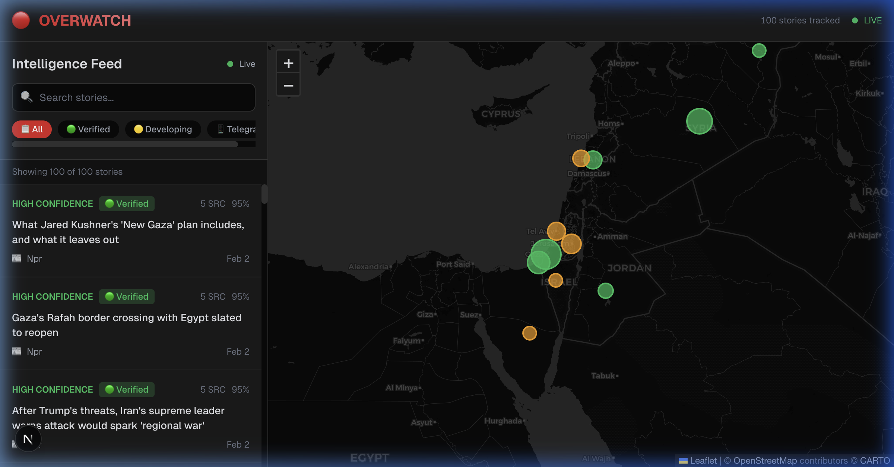

<p align="center">
  <h1 align="center">OVERWATCH</h1>
  <p align="center">
    <strong>Real-Time Geopolitical Conflict Monitoring & OSINT Intelligence Platform</strong>
  </p>
  <p align="center">
    <em>AI-powered hybrid conflict monitor that correlates kinetic events with information reliability metrics</em>
  </p>
  <p align="center">
    <a href="#features">Features</a> •
    <a href="#architecture">Architecture<science /a> •
    <a href="#tech-stack">Tech Stack</a> •
    <a href="#getting-started">Getting Started</a> •
    <a href="#api-reference">API</a> •
    <a href="#license">License</a>
  </p>
</p>

---


*Live intelligence dashboard — news feed with confidence scoring on the left, tactical dark-themed map with priority-coded markers on the right.*

---

## Overview

**OverWatch** (Project Sentinel) is a full-stack geopolitical intelligence platform focused on the Middle East. It ingests multi-source OSINT data — from GDELT conflict events and military flight patterns to Telegram channels and RSS news feeds — and processes it through an AI-powered verification pipeline. The system uses a **multi-agent debate architecture** powered by Claude (Anthropic) and LangGraph to produce credibility scores, cross-reference corroboration, and structured analysis for every tracked event.

The result is a real-time **intelligence dashboard** with a live news feed, interactive geospatial map, and transparent AI reasoning — giving analysts and researchers a single pane of glass into conflict dynamics.

---

## Features

### Multi-Source Data Ingestion
- **GDELT 2.0 Events** — Polls for material conflict events (CAMEO codes 190–195: military force, bombing, shelling) within a defined Middle East bounding box
- **Flight Tracking** — Monitors ADS-B Exchange for military aircraft patterns and proximity to kinetic events
- **News Feeds** — Scrapes RSS/Atom feeds from tiered news sources (Tier 1 wire services through Tier 3 regional outlets)
- **Telegram Scraping** — MTProto-based ingestion from conflict-focused Telegram channels using Telethon

### AI-Powered Verification Engine
- **Credibility Scoring** — Source-tier–based scoring with cross-reference bonuses, recency weighting, and multi-source corroboration
- **Multi-Agent Debate** (LangGraph) — Three-agent workflow (Analyst Pro → Analyst Con → Judge) that debates event credibility using structured arguments and delivers a 0–100 confidence score
- **Newsroom Debate** — For gray-zone articles (score 46–74): a Reporter → Fact-Checker → Editor pipeline that produces verified claims, unverified claims, gaps, and editorial assessments
- **Source Comparison** — For high-confidence articles (score 75+): highlights differences in how multiple sources report the same story
- **Correlation Engine** — Spatial linking of events to nearby flights within 50km/1hr, and narrative linking of articles mentioning the same locations via Neo4j graph traversals

### Interactive Geospatial Dashboard
- **Dark-Themed Tactical Map** — Leaflet + CartoDB dark tiles centered on the Middle East
- **Priority-Coded Markers** — Color-coded by confidence level (🟢 Verified, 🟡 Developing, 🔴 Unverified), sized by article count
- **Live Intelligence Feed** — Filterable by status (All, Verified, Developing, Telegram) with real-time search
- **Confidence Badges** — Each story displays its confidence level, source count, and credibility score
- **News-Map Synchronization** — Clicking a story highlights its location on the map and vice versa

### Confidence Classification System

| Level | Score Range | Label | Description |
|-------|-----------|-------|-------------|
| 🟢 | 85–100 | **Verified** | High confidence — corroborated by multiple tier-1 sources |
| 🟢 | 70–84 | **Likely Verified** | Good confidence — strong multi-source support |
| 🟡 | 50–69 | **Developing** | Moderate confidence — story still being corroborated |
| 🔴 | 30–49 | **Unverified** | Low confidence — limited or single-source |
| ⚫ | 0–29 | **Unconfirmed** | Very low — treat with extreme caution |

### Knowledge Graph (Neo4j)
- **Entity Relationships** — Events, articles, posts, flights, sources, channels, and locations stored as graph nodes with rich relationship edges
- **Graph Traversals** — `:CORROBORATES`, `:DETECTED_NEAR`, `:MENTIONS`, `:PUBLISHED`, `:OCCURRED_IN`, `:PATROLLING` relationships enable multi-hop reasoning
- **APOC & GDS Plugins** — Graph Data Science algorithms for pattern detection and graph neural network integration

---

## Architecture

```
┌─────────────────────────────────────────────────────────────────────┐
│                        OVERWATCH PLATFORM                          │
├─────────────────────────────────────────────────────────────────────┤
│                                                                     │
│  ┌──────────────────────────────────────────────────────────────┐   │
│  │                MODULE A: "THE EARS" (Ingestion)              │   │
│  │                                                              │   │
│  │  ┌──────────┐ ┌──────────┐ ┌──────────┐ ┌──────────────┐   │   │
│  │  │  GDELT   │ │  Flight  │ │   News   │ │   Telegram   │   │   │
│  │  │  Events  │ │  Tracker │ │  Scraper │ │   Scraper    │   │   │
│  │  └────┬─────┘ └────┬─────┘ └────┬─────┘ └──────┬───────┘   │   │
│  └───────┼─────────────┼────────────┼──────────────┼───────────┘   │
│          │             │            │              │                │
│          └─────────────┴─────┬──────┴──────────────┘                │
│                              │                                      │
│                              ▼                                      │
│  ┌──────────────────────────────────────────────────────────────┐   │
│  │                MODULE B: "THE BRAIN" (Analysis)              │   │
│  │                                                              │   │
│  │  ┌────────────┐  ┌────────────┐  ┌────────────────────────┐ │   │
│  │  │ Credibility│  │  Geoloc.   │  │   AI Verification      │ │   │
│  │  │  Scoring   │──│  Extract   │──│  ┌──────────────────┐  │ │   │
│  │  └────────────┘  └────────────┘  │  │  Multi-Agent     │  │ │   │
│  │  ┌────────────┐                  │  │  Debate (Judge)  │  │ │   │
│  │  │Correlation │                  │  ├──────────────────┤  │ │   │
│  │  │  Engine    │ ←── Neo4j ──────►│  │  Newsroom Debate │  │ │   │
│  │  └────────────┘                  │  │  (Editor Chain)  │  │ │   │
│  │                                  │  ├──────────────────┤  │ │   │
│  │                                  │  │  Source Compare  │  │ │   │
│  │                                  │  └──────────────────┘  │ │   │
│  │                                  └────────────────────────┘ │   │
│  └──────────────────────────┬───────────────────────────────────┘   │
│                             │                                       │
│                             ▼                                       │
│  ┌──────────────────────────────────────────────────────────────┐   │
│  │                MODULE C: "THE FACE" (UI)                     │   │
│  │                                                              │   │
│  │  ┌────────────────┐  ┌──────────────────────────────────┐   │   │
│  │  │  Intelligence  │  │    Dark-Themed Tactical Map      │   │   │
│  │  │  News Feed     │  │    (Leaflet + CartoDB Tiles)     │   │   │
│  │  │  w/ Filters    │  │    Priority-Coded Markers         │   │   │
│  │  └────────────────┘  └──────────────────────────────────┘   │   │
│  └──────────────────────────────────────────────────────────────┘   │
│                                                                     │
│  ┌──────────────────┐  ┌──────────────────┐                        │
│  │  FastAPI Server   │  │  Neo4j + Docker  │                        │
│  │  REST API         │  │  Graph Database  │                        │
│  └──────────────────┘  └──────────────────┘                        │
└─────────────────────────────────────────────────────────────────────┘
```

---

## Tech Stack

### Backend
| Technology | Purpose |
|---|---|
| **Python 3.9+** | Core backend language |
| **FastAPI** | Async REST API framework |
| **LangChain** | LLM orchestration |
| **LangGraph** | Multi-agent debate workflow graphs |
| **Anthropic Claude** | LLM provider for AI analysis |
| **Neo4j 5.15** | Graph database for entity relationships |
| **Telethon** | Telegram MTProto client for channel scraping |
| **GDELT** | Global conflict event data |
| **Pandas** | Data manipulation and processing |

### Frontend
| Technology | Purpose |
|---|---|
| **Next.js 16** | React framework with App Router |
| **React 19** | UI component library |
| **TypeScript** | Type-safe development |
| **Tailwind CSS 4** | Utility-first styling |
| **Leaflet** | Interactive map rendering |
| **CartoDB Dark Tiles** | Dark-themed tactical map layer |

### Infrastructure
| Technology | Purpose |
|---|---|
| **Docker Compose** | Container orchestration |
| **Neo4j APOC** | Advanced database procedures |
| **Neo4j GDS** | Graph Data Science algorithms |

---

## Project Structure

```
OverWatch/
├── backend/
│   ├── agents/                     # Module A: Data Ingestion
│   │   ├── ingest_gdelt.py         # GDELT 2.0 conflict event poller
│   │   ├── fetch_flights.py        # ADS-B military flight tracker
│   │   ├── fetch_news.py           # RSS/Atom news feed scraper
│   │   └── fetch_telegram.py       # Telegram MTProto channel scraper
│   ├── analysis/                   # Module B: Verification Engine
│   │   ├── score_articles.py       # Credibility scoring pipeline
│   │   ├── agentic_scoring.py      # Multi-agent debate (LangGraph)
│   │   ├── newsroom_debate.py      # Reporter→Fact-Checker→Editor chain
│   │   ├── correlate.py            # Multi-source corroboration engine
│   │   ├── geolocate.py            # Location extraction & geocoding
│   │   └── test_debate.py          # Debate system test suite
│   ├── api/
│   │   └── main.py                 # FastAPI server & REST endpoints
│   ├── database/
│   │   └── load_graph.py           # Neo4j ETL (graph data loader)
│   ├── .env.example                # Environment variable template
│   └── requirements.txt            # Python dependencies
├── frontend/
│   ├── app/
│   │   ├── layout.tsx              # Root layout with metadata
│   │   ├── page.tsx                # Home page (renders Dashboard)
│   │   └── globals.css             # Global styles & design tokens
│   ├── components/
│   │   ├── Dashboard.tsx           # Main dashboard (fetches data, manages state)
│   │   ├── map/
│   │   │   ├── MapPanel.tsx        # Interactive Leaflet map with markers
│   │   │   └── MapWrapper.tsx      # Dynamic import wrapper (SSR-safe)
│   │   └── news/
│   │       ├── NewsPanel.tsx       # News feed with search & filters
│   │       └── NewsCard.tsx        # Individual story card component
│   ├── lib/
│   │   └── api.ts                  # API client & TypeScript interfaces
│   └── package.json                # Node.js dependencies
├── data/                           # Raw data storage (gitignored)
├── neo4j/                          # Neo4j data volumes (gitignored)
├── docker-compose.yml              # Neo4j + plugins container config
└── README.md
```

---

## Getting Started

### Prerequisites

- **Python** 3.9+
- **Node.js** 18+
- **Docker** & Docker Compose
- **Anthropic API Key** (for AI analysis features)
- **Telegram API Credentials** (optional, for Telegram scraping)

### 1. Clone the Repository

```bash
git clone https://github.com/yourusername/OverWatch.git
cd OverWatch
```

### 2. Start Neo4j Database

```bash
docker-compose up -d
```

Neo4j will be available at:
- **Browser UI**: http://localhost:7474
- **Bolt Protocol**: `bolt://localhost:7687`
- **Default Credentials**: `neo4j` / `sentinel_password`

### 3. Setup Backend

```bash
cd backend

# Create and activate virtual environment
python3 -m venv venv
source venv/bin/activate       # macOS/Linux
# venv\Scripts\activate        # Windows

# Install dependencies
pip install -r requirements.txt

# Configure environment variables
cp .env.example .env
# Edit .env with your API keys
```

#### Required Environment Variables

```env
# Telegram (for Agent_Telegram)
TELEGRAM_API_ID=your_api_id_here
TELEGRAM_API_HASH=your_api_hash_here

# Neo4j
NEO4J_URI=bolt://localhost:7687
NEO4J_USER=neo4j
NEO4J_PASSWORD=sentinel_password

# Anthropic (for AI analysis)
ANTHROPIC_API_KEY=your_anthropic_api_key_here
```

### 4. Run Data Ingestion Pipeline

```bash
# Ingest GDELT conflict events
python agents/ingest_gdelt.py

# Fetch news articles from RSS feeds
python agents/fetch_news.py

# Fetch Telegram posts (requires API credentials)
python agents/fetch_telegram.py

# Fetch military flight data
python agents/fetch_flights.py
```

### 5. Run Analysis Pipeline

```bash
# Score articles with credibility metrics
python analysis/score_articles.py

# Load data into Neo4j graph
python database/load_graph.py

# Run correlation engine (requires Neo4j)
python analysis/correlate.py
```

### 6. Start the API Server

```bash
python -m uvicorn api.main:app --host 0.0.0.0 --port 8000 --reload
```

API docs available at: http://localhost:8000/docs

### 7. Setup Frontend

```bash
cd frontend

# Install dependencies
npm install

# Start development server
npm run dev
```

Open http://localhost:3000 to view the dashboard.

---

## API Reference

The FastAPI backend serves a RESTful API at `http://localhost:8000`.

| Method | Endpoint | Description |
|--------|----------|-------------|
| `GET` | `/` | API status and metadata |
| `GET` | `/items` | List scored content (paginated, filterable, searchable) |
| `GET` | `/items/{id}` | Get single item with full AI analysis |
| `GET` | `/stats` | Summary statistics and confidence breakdown |
| `GET` | `/verified` | Shortcut for Verified & Likely Verified content only |
| `GET` | `/breaking` | Recent Telegram posts (potential breaking news) |
| `GET` | `/map/markers` | Aggregated map markers by location |
| `GET` | `/map/events` | Geolocated articles for map display |

### Query Parameters for `/items`

| Parameter | Type | Description |
|-----------|------|-------------|
| `page` | int | Page number (default: 1) |
| `page_size` | int | Items per page, max 100 (default: 20) |
| `status` | string | Filter by status: `Verified`, `Likely Verified`, `Developing`, `Unverified`, `Unconfirmed` |
| `content_type` | string | Filter by type: `article`, `telegram` |
| `source` | string | Filter by source ID |
| `min_score` | int | Minimum confidence score (0–100) |
| `q` | string | Search in title and summary |
| `sort_by` | string | Sort by: `score`, `date`, `source` |
| `order` | string | Sort order: `asc`, `desc` |

### Example Requests

```bash
# Get top verified stories
curl http://localhost:8000/verified

# Search for stories about Gaza
curl "http://localhost:8000/items?q=gaza&sort_by=score&order=desc"

# Get map markers for the visualization
curl http://localhost:8000/map/markers

# Get breaking Telegram posts
curl http://localhost:8000/breaking
```

---

## AI Verification Pipeline

OverWatch uses a tiered AI analysis system based on the article's heuristic credibility score:

### Tier 1: Multi-Agent Debate (Score ≤ 45 with evidence)

A **LangGraph** workflow runs three adversarial agents:

1. **Analyst Pro** — Generates structured arguments *supporting* the event's credibility
2. **Analyst Con** — Generates structured arguments *against* the event's credibility  
3. **Judge** — Weighs both arguments, renders a final verdict with a 0–100 confidence score and detailed reasoning

### Tier 2: Newsroom Debate (Score 46–74)

A sequential **Reporter → Fact-Checker → Editor** chain:

1. **Reporter** — Summarizes the article objectively
2. **Fact-Checker** — Identifies verified claims, unverified claims, source biases, and information gaps
3. **Editor** — Delivers a final credibility assessment and reader advisory

### Tier 3: Source Comparison (Score 75+)

For high-confidence stories covered by multiple sources, the system highlights:
- **Core agreement** across sources
- **Potential differences** in framing or details
- **Source-specific perspectives** and biases

---

## Neo4j Graph Schema

```
(:Event)-[:OCCURRED_IN]->(:Location)
(:Source)-[:PUBLISHED]->(:Article)
(:Article)-[:MENTIONS]->(:Location)
(:Article)-[:CORROBORATES]->(:Event)
(:Channel)-[:POSTED]->(:Post)
(:Post)-[:CORROBORATES]->(:Event)
(:Flight)-[:DETECTED_NEAR]->(:Event)
(:Flight)-[:PATROLLING]->(:Location)
```


</p>
